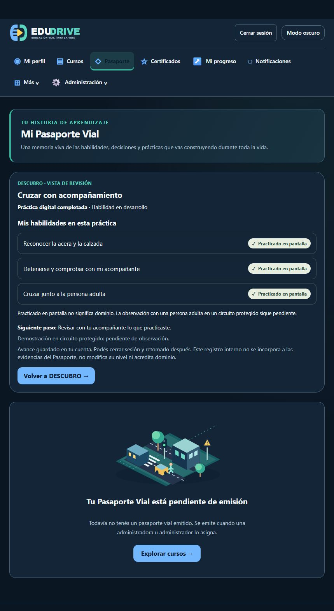

# DESCUBRO — Ajuste del Pasaporte publicado

Fecha: 27 de septiembre de 2026. Versión: `descubro-review-20260927r2`.
Destino: https://app.edudrive.vr506.com/mi-pasaporte-vial.

Dos archivos modificados: `resources/views/road-passport/show.blade.php` y `resources/views/descubro/session-card.blade.php`. El encabezado del Pasaporte sin emitir ahora describe la emisión pendiente. La tarjeta omite el rótulo secundario de fase cuando la fase es `result`; conserva el paso actual en prácticas en curso, incluso si existe una vuelta anterior completada.

Verificación: cuatro pruebas aisladas, 69 aserciones, para resumen inicial/parcial y Pasaporte vacío/emitido. La imagen candidata compiló las vistas. En producción se verificaron huellas de ambos archivos, salud HTTP 200, acceso anónimo a DESCUBRO redirigido al ingreso y contenido visible en la sesión administrativa. La captura muestra un único estado completado, tres habilidades practicadas y el nuevo encabezado.

No hubo migraciones, reinicios de progreso ni cambios de permisos. DESCUBRO conserva la restricción a cuentas activas con rol global `super_admin`. La navegación de comprobación no inició otra práctica ni emitió el Pasaporte.

## Entrega y reversión

- Imagen app/worker/scheduler: `edudrive-api:descubro-review-20260927r2`, ID `sha256:e33ae063c7473f1b423c999fcf39eb55de8ad15c3f67f597eadf8ed30481464b`.
- Nginx conserva `edudrive-nginx:descubro-review-20260927r1`; fue recreado con los servicios de aplicación.
- Paquete SHA256: `76a69f6c1fafd163afcfd48d2c22a2ed759c955c137a83c46a73a06316a8d377`.
- Registro remoto: `/opt/edudrive/releases/descubro-review-20260927r2/deployment-complete.json`.
- Override activo: `/opt/edudrive/compose.descubro-review.yaml`. Incluirlo junto a los overrides prod/bootstrap en futuras operaciones.
- Override anterior: `/opt/edudrive/releases/descubro-review-20260927r2/compose.before.yaml`. Para revertir, restaurarlo como override activo, recrear app/worker/scheduler/nginx y ejecutar `php artisan optimize` en la app. Las imágenes r1 se conservaron. No se ejecutó reversión.
- Respaldo local de los dos archivos: `tmp/descubro-copy/backup-20260927-192355`.
- Respaldo de datos r1 conservado en el servidor; este ajuste no requirió modificar la base.

