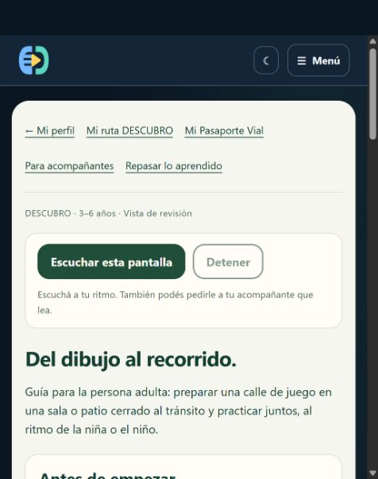

# DESCUBRO — Guía acompañada publicada

Fecha: 28 de septiembre de 2026. Versión: `descubro-review-20260928r1`.
Vista: https://app.edudrive.vr506.com/descubro/cruzar-acompanado?page=circuit.

Se amplió la guía «Del dibujo al recorrido» con preparación del espacio protegido, tres pasos con consignas para la persona adulta, observación formativa de S1–S3, formas de comunicación y apoyo, pausas y variantes representadas de garaje y pelota. Fuente curricular: EDU-PED-001.E1, matriz 2.0.0-borrador.1. No se modificó esa matriz ni se cerraron sus anclas pendientes.

La guía sigue en revisión administrativa. No recoge evaluaciones, no acredita dominio, no habilita participantes y no modifica el avance digital. No se ha realizado una aplicación presencial. La lectura opcional usa las marcas existentes; no se realizó una nueva comprobación auditiva en esta entrega.

## Verificación

- Cuatro pruebas existentes pasaron con 81 aserciones: navegación, aislamiento por cuenta, práctica repetida y resúmenes inicial/parcial.
- La imagen candidata compiló las vistas. Se comprobaron la huella del archivo publicado, salud HTTP 200 y redirección de acceso anónimo.
- La sesión administrativa mostró las cinco secciones de la guía. «Volver a mi recorrido» recuperó el resultado completado con las tres habilidades practicadas; el enlace al siguiente paso volvió a abrir la guía.
- Vista inspeccionada de 499 píxeles, sin desbordamiento horizontal y sin formularios que modifiquen la práctica en la guía.
- Captura de ventana verificada: `DESCUBRO_guia_vista_20260928.png`. La captura de página completa `DESCUBRO_guia_acompanada_20260928.png` presentó un defecto de composición; no se usa como evidencia visual. El DOM contenía una única sección «Tres pasos para hacer juntos».

## Registro operativo

Archivo modificado: `resources/views/descubro/crossing.blade.php`.
Respaldo local: `tmp/descubro-circuit/backup-20260928-075727`.

Imagen app/worker/scheduler: `edudrive-api:descubro-review-20260928r1`, ID `sha256:af548196f23e7da6a998a2dcb5a433c7ebe261be315d67673576a566f9239399`. Nginx conserva la imagen `descubro-review-20260927r1`.

Paquete SHA256: `5fd79779f28b1ab585f8d643ffd48e08398cec2647bfd35d5d42a8db7c5fb630`.
Directorio remoto: `/opt/edudrive/releases/descubro-review-20260928r1`.

El override activo sigue siendo `/opt/edudrive/compose.descubro-review.yaml`; incluirlo junto a prod/bootstrap en futuras operaciones. `compose.before.yaml` en el directorio de esta entrega conserva la configuración r2 anterior. Reversión: restaurar ese override, recrear app/worker/scheduler/nginx y ejecutar `php artisan optimize` en la app. Las imágenes anteriores se conservaron. No se ejecutó reversión ni migración.

